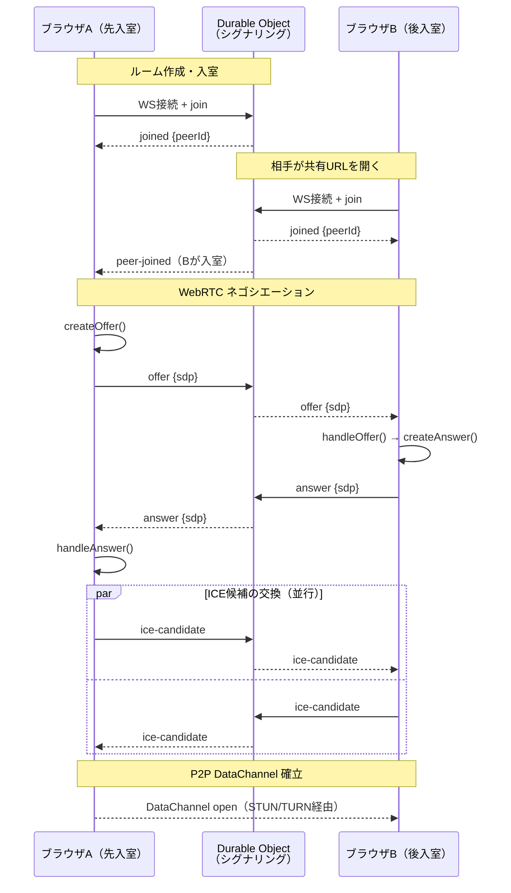
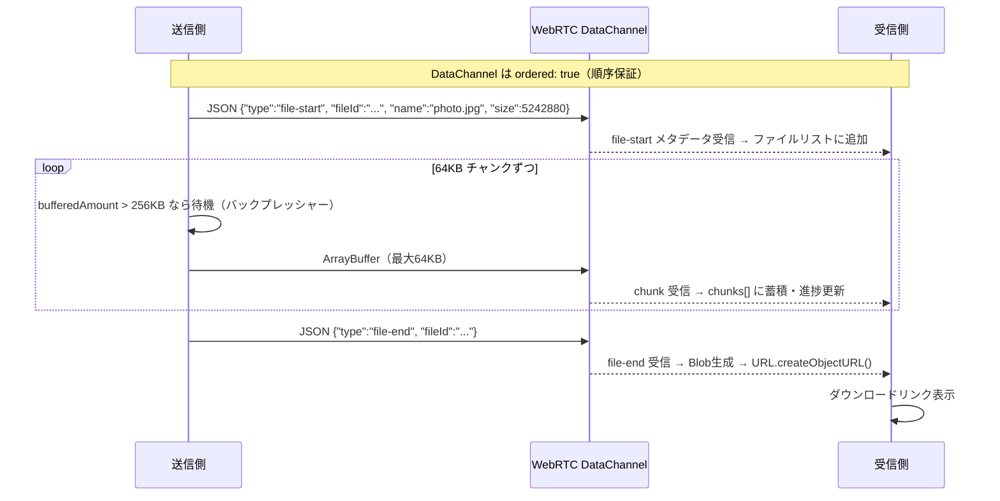
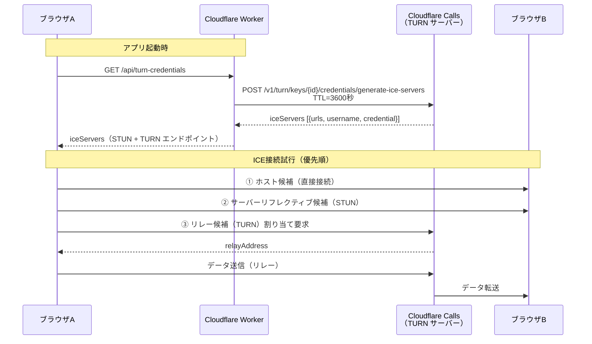

# WebRTC File Exporter

WebRTC DataChannel を使ったブラウザ間 P2P ファイル転送アプリ。

## 特徴

- **P2P 直接転送**: サーバーを経由せずブラウザ間で直接ファイル転送
- **大容量対応**: バックプレッシャー制御による安定した大ファイル転送
- **NAT越え**: Cloudflare TURN サーバーによる確実な接続確立
- **シンプルな UI**: URL 共有だけで接続開始

## セットアップ

### 必要環境

- Node.js v18 以上
- Cloudflare アカウント
- Wrangler CLI (`npm install -g wrangler`)

### インストール

```bash
# Worker 依存関係
cd worker && npm install

# フロントエンド依存関係
cd frontend && npm install
```

### 設定

1. Cloudflare Calls で TURN Key を作成
2. Worker にシークレットを設定:
   ```bash
   cd worker
   wrangler secret put TURN_KEY_ID
   wrangler secret put TURN_KEY_API_TOKEN
   ```

### 開発

```bash
# Worker をローカル起動
cd worker && npm run dev

# フロントエンド開発サーバー（別ターミナル）
cd frontend && npm run dev
```

### デプロイ

```bash
cd frontend && npm run build
cd worker && wrangler deploy
```

## 使い方

1. https://webrtc-file-exporter.0g0.xyz にアクセス
2. 「ルームを作成」ボタンをクリック
3. 表示された URL を相手に共有
4. 相手が URL にアクセスすると接続が確立
5. ファイルをドラッグ＆ドロップで転送開始

## アーキテクチャ

```
ブラウザA ──WebSocket──> Cloudflare Worker ──> Durable Object (シグナリング)
                                                      │
ブラウザB ──WebSocket──> Cloudflare Worker ────────────┘
                                              (SDP/ICE候補の交換)

シグナリング完了後:
ブラウザA ──WebRTC DataChannel (P2P or TURN relay)──> ブラウザB
```

## 技術的仕組み

### 1. シグナリング〜接続確立フロー



### 2. ファイル転送プロトコル



### 3. NAT越え（TURN）フロー



## ライセンス

MIT
